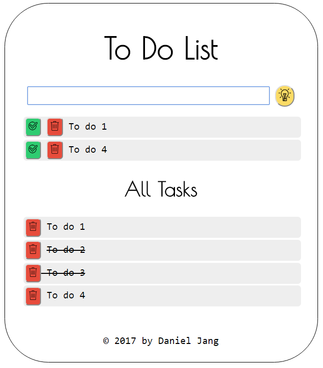

# To Do List App
(for webcanada project)

Features
- There are two lists, one for not completed tasks, and the other for all lists.
- Add a new task by clicking button or pressing enter key
- When you complete a task, it will be removed in the upper list, but stay in the bottom list
- When tou delete a task, it will be gone from the list and the DB.
- Reponsive design for multiple devices

Skills
- jQuery 
- Firebase 
- SCSS
